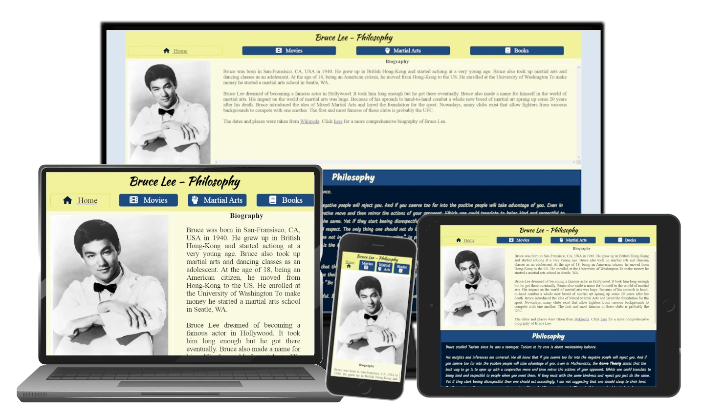
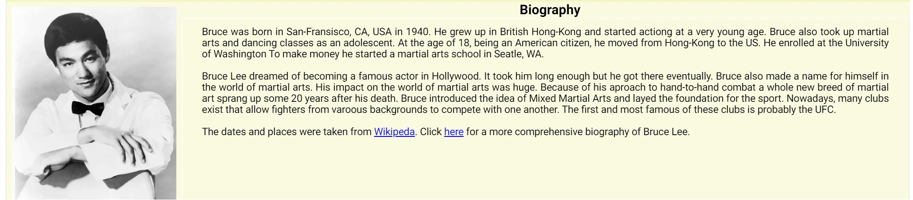
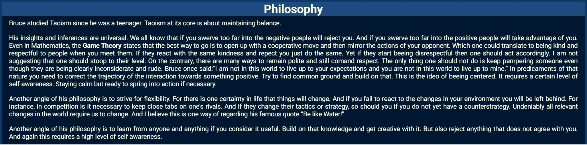
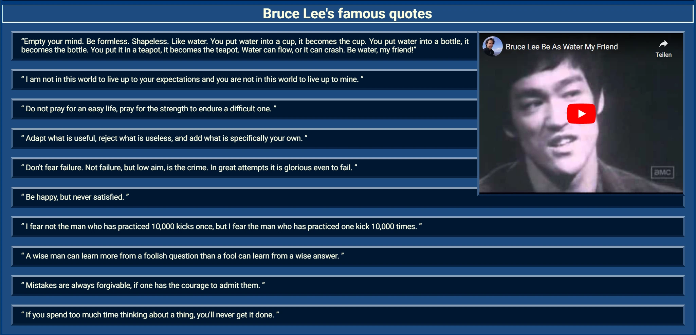
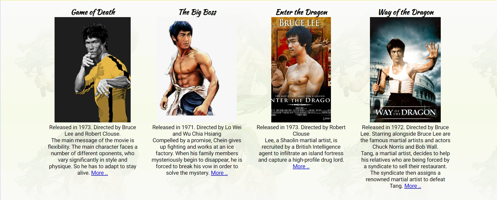
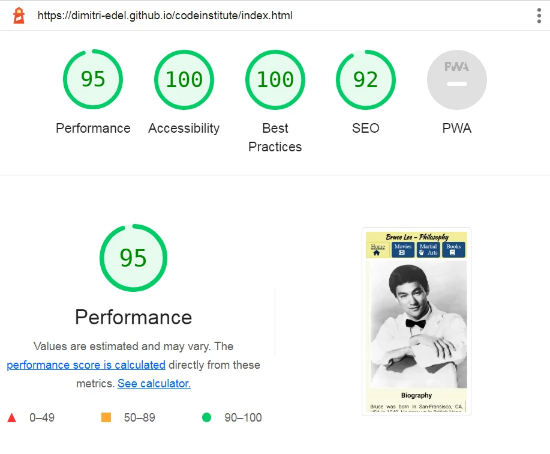
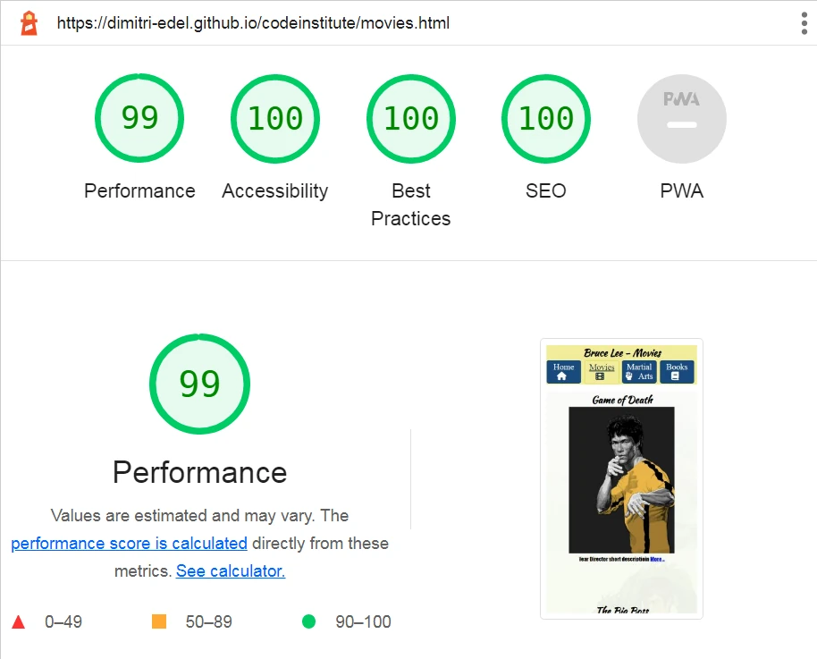
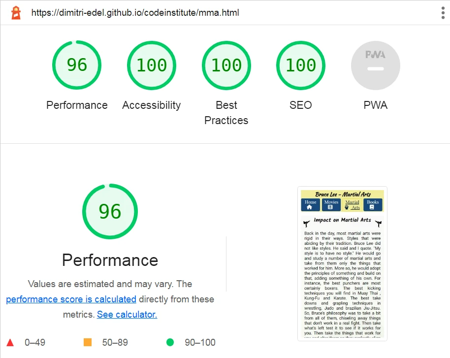
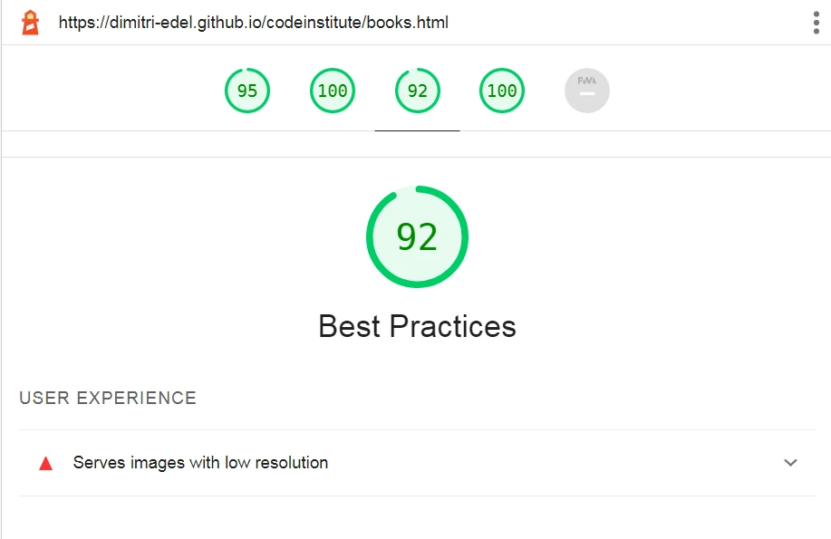

# Bruce Lee's philosphy

## Preparation
Since I remember Bruce Lee from my childhood I did not know much about him. First of all I had to do some research and read up on his life and his body of work. In the proecess I came to see him in a different light, a more positive light. 
### Content
First of all, I summarized his biography in a few words. I took the dates and places from wikipedia, which I mentioned at the end of the biography section and have also provided a link to the wikipedea page. What I mostly learned about Bruce Lee was his philosophy, so I decided to dedicate the most part of the home page to that subject. I found his most famous quotes on fourminutebooks.com, which is also mentioned in the Credit Section of this file. Also, I put some of his phylosphical ideas in a few of my own words.

Secondly, I assembled a list of his most iconic movies. Eventually, only four of them made it onto the page. Not least, due to the fact that most images of him and the movie covers are copyrighted.
I even had to make a movie cover myself. It took me while, but eventually I found a free image, that depicted the persona he was playing in the movie.

Thirdly, I studied up on his impact on martial arts and the new martial art he put together named Jeet Kune Do. I summarized what I had learned in two separate articles: 'Impact on Martial Arts' and 'Jeet Kune Do'. I posted the articles on the Martial Arts Page.

Lastly, I made a page with showcases of the three books that he has written. I also put out a form that invites the user to order one of his books off the website.
### Images
Finding free images of this person  was quite a piece of work and took up a lot of time. Consequently, it was not possible for me to have as many images at my disposal as I wish I had.
### Layout
I decided to go with one of the most basic layouts: Title and navigation bar at the top, content in the middle and a footer at the bottom. 
#### Home page
The home page is devided into three sections. One is biography with an portrait image of Bruce Lee and a summary of his biography as text.
#### Movies page
The content of this page is wrapped in a div that uses the CSS-class 'wallpaper'. All it does is apply an image as a background. In addition to that, each movie is wrapped in a div that uses the CSS-class 'movie-box'.
#### Martial Arts page
The content of this page is wrapped in a div that uses the CSS-class 'wallpaper'. There are two articles. The first one is called 'Impact on Martial Arts' and has a tag-id of 'impact-on-mma'.
The second article is on Jeet Kune Do and has the id-tag of 'jeet-kune-do-article'.
#### Books page
The content of this page is wrapped in a div that uses the CSS-class 'wallpaper'. Each book is presented in a div that uses the CSS-class of 'book-showcase'. Furthermore, there is a form that has the tag-id of 'bookorder-form'.
### Colors
I decided to go with the colors of the jumpsuit that Bruce Lee is wearing in his movie 'Game of Death'. But instead of using just yellow, black and white. I have also added blue to the mix. Some elements, such as the footer have a darkgray background. In my humble opinion these colors do not bite eachother. I have heard that white, black and gray are not considered real colors and thus are considered neutral.

## Features
The main purpose of the site is to give the user the highlights of the legendary persona by the name of Bruce Lee. The site gives a brief biography of the celebrity. In addition, the website provides a summary on Bruce Lee's body of work including his most iconic movies and information on his impact on the world of martial arts.
Furthermore, the user is offered a posibilty to order one of his books.
### Navigation
The website has a navigation bar with links to all of the four pages. The navigation bar lives in the header section alongside the main title heading. The navigation bar also displays the name of the page and highlights the current webpage link.

Navigation bar structure
Name of page
- Home
- Movies
- Martial arts
- Books

### Home page
The home page contains a short biography and two articles on Bruce Lee's philosophy.
#### MENU BAR

#### BIOGRAPHY

#### PHILOSOPHY

#### FAMOUS QUOTES

### Movies page
The page only covers the most iconic movies with Bruce Lee playing the main character.

### Martial Arts page
The page explains why Bruce Lee had an impact on martial arts. It also tells us about what principles Bruce applied in the Martial Art he created called Jeet Kune Do.

### Books page
The page gives a short descritpion of all of Bruce Lee's books on martial arts and provides the user with the opportunity to order one of his books.

##### order form
Ensured that all of the input fields have been filled in, by using the 'required' attribute.
image
## Content
All the articles were written by me. I did some research on Bruce Lee and put down the things I had learned about this person. 
Finding images that are not copyrighted was a piece of work. Most images of this person are copyrighted and thus out of the question.
## Responsive Design
I used media queries to add two breakpoints. The first one sets in, if the screen size is at least 640 pixels in width. The second one is at 1200 pixels.
I have used the developer tools in Google Chrome to see how it looks on different devices. The structure remains in tact.
## Testing
### LIGHTHOUSE
Didn't have enough time to straighten out all issues with performance. Most of them come down to using third party resources such as fontawsome and google fonts. 
Also, I used a lazy technique for sizing most of the images by using the auto value for either the height or the width of a given image. I was going to get that taken
care of if I had enough time. 
#### home page

#### movies page

#### martial arts page

#### books page

The facts that I used low resolution images for one of the icons takes away some score from the Best Practices.
### Bugs
A few minor bugs came up at the first test. But all of them were typos and were fixed immediately.
During the second test, I encountered an issue. When scrolling down the page some of the elements would slide over the menu bar, making the menu bar appear transparent.
I fixed the issue by applying the z-index property to the elements in question.
### Validator Testing
The pages have been tested by validator.w3.org and jigsaw.w3.org/css-validator and have passed the tests.
## Deployment
The site has been deployed from GitHub Pages. The way to do that was to go to the settings. Click on the Pages icon. Select the repository and the branch. And click on Publish. And that was that.
## Technologies
- GitHub
- GitPod
- Gimp wsa used to manipulate images
- Chhrome Developer Tools for testing and debugging

## Credits
### HTML & CSS Coding
- w3schools as a tutorial for more sophisticated HTML & CSS
- Code Institute tutorials for Basic HTML & CSS 
### Content
- Much of the information about everything related to martial arts and Bruce Lee's part in it came from whatching videos on youtube.com
- The short descriptions of the movies came from Google 
- Bruce Lee's biography and the list of his books and movies I found on wikipedia.org
- Bruce Lee's famous quotes were taken from fourminutebooks.com 
- The principles on how to set up a webpage came from watching the videos about the Love Running Project by Code Institute
### Media
- wallpapersafari.com (Image for 'Enter the Dragon')
- kindpng.com (Image for 'The Big Boss')
- wallpaperaccess.com (Image for 'Game of Death') 
- china-underground.com (Image for 'Way of the Dragon')
- en.picmix.com (Image of Bruce Lee with a dragon in the background)
- freesvg.org (Portrait of Bruce Lee on the Home Page)
- wikipedia.org (Images of the book covers)
- icon-library.com (Image for martial arts page : high kick icon)
- pngegg.com (Image for Jeet Kune Do Symbol)
- youtube.com (short clips of Bruce Lee)
- freepik.com (Images of monitor and laptop)